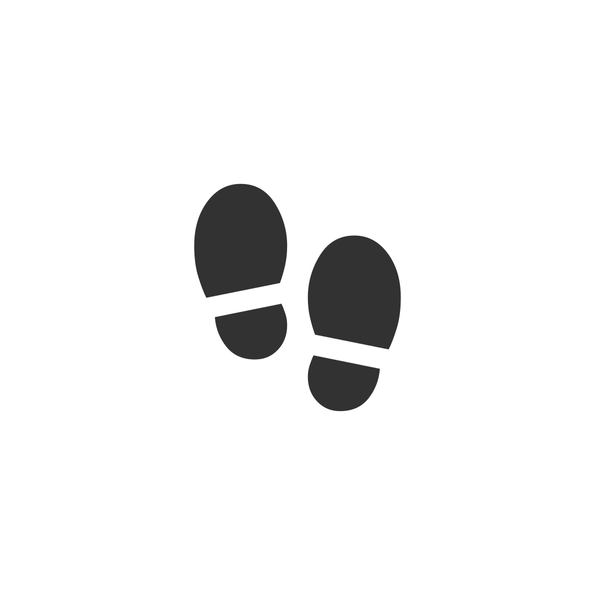

# أثر · Athar

**Focus. Log. Leave a Mark.**
ركّز. سجّل. اترك أثراً.

[🌐 Website](https://nacer0s.github.io/athar/) · [📥 Download APK](https://github.com/nacer0s/athar/releases/latest/download/app-release.apk) · [📋 Releases](https://github.com/nacer0s/athar/releases)

---

## What is Athar?

**Athar (أثر)** is a minimalist, fully offline focus timer paired with a micro-journaling system.
No account. No cloud. No tracking. Just you and your work.

Built with Flutter — adaptive UI for Android (Material 3) and iOS (Cupertino),
fully bilingual in **Arabic** and **English** with complete RTL support.

---

## 📥 Install

### Android

1. [**Download the latest APK →**](https://github.com/nacer0s/athar/releases/latest/download/app-release.apk)
2. On your device: **Settings → Install unknown apps → Allow**
3. Open the downloaded APK and tap Install
4. Launch **Athar أثر**

> Minimum Android version: **5.0 (API 21)**

### iOS

Coming in a future release. Follow [Releases](https://github.com/nacer0s/athar/releases) for updates.

---

## ✨ Features

### 🎯 Focus Timer
- Configurable session length (5 – 120 min)
- Start · Pause · Resume · Reset
- Session-complete celebration state
- Runs 100% offline

### 📝 Micro Journal
- Log a note after every session
- Quick-fill tag chips
- Star sessions to bookmark them
- Swipe-to-delete with undo
- Full-text search & filters (All · Starred · This Week)

### 📊 Statistics
- 7-day focus bar chart
- 28-day activity heatmap
- Current & longest streak tracker
- Time-of-day distribution ring
- Hero stat cards (sessions, hours, average, starred)
- Best session highlight

### ⚙️ Settings
- Focus duration picker
- Language toggle: **English ↔ العربية** (instant RTL switch)
- Theme: Light · Dark · System
- Notification toggles (session complete, daily reminder, vibrate)
- Clear all data

### 🎨 Design
- Material 3 (Android) + Cupertino (iOS)
- Animated splash screen — light & dark variants
- Full RTL layout throughout every screen
- Custom Athar logo mark

---

## 🛠 Tech Stack

| Layer | Technology |
|---|---|
| Framework | Flutter 3.22 |
| Language | Dart 3.3 |
| State Management | Provider |
| Local Storage | Hive |
| SVG Rendering | flutter_svg |
| Localization | flutter_localizations + custom S class |
| Typography | Cairo Variable Font |
| UI | Material 3 + Cupertino adaptive |

---

## 🔧 Build from Source

### Prerequisites
- Flutter 3.22+
- Dart 3.3+
- Android SDK 35
- Node.js (for SVG → PNG conversion)

### Steps

# 1. Clone
git clone https://github.com/nacer0s/athar.git
cd athar

# 2. Install packages
flutter pub get

# 3. Generate Hive adapters
dart run build_runner build --delete-conflicting-outputs

# 4. Generate icons & splash PNGs from SVGs
npm install
node scripts/generate_pngs.mjs
dart run flutter_launcher_icons
dart run flutter_native_splash:create

# 5. Run in debug
flutter run

# 6. Build release APK
flutter build apk --release
